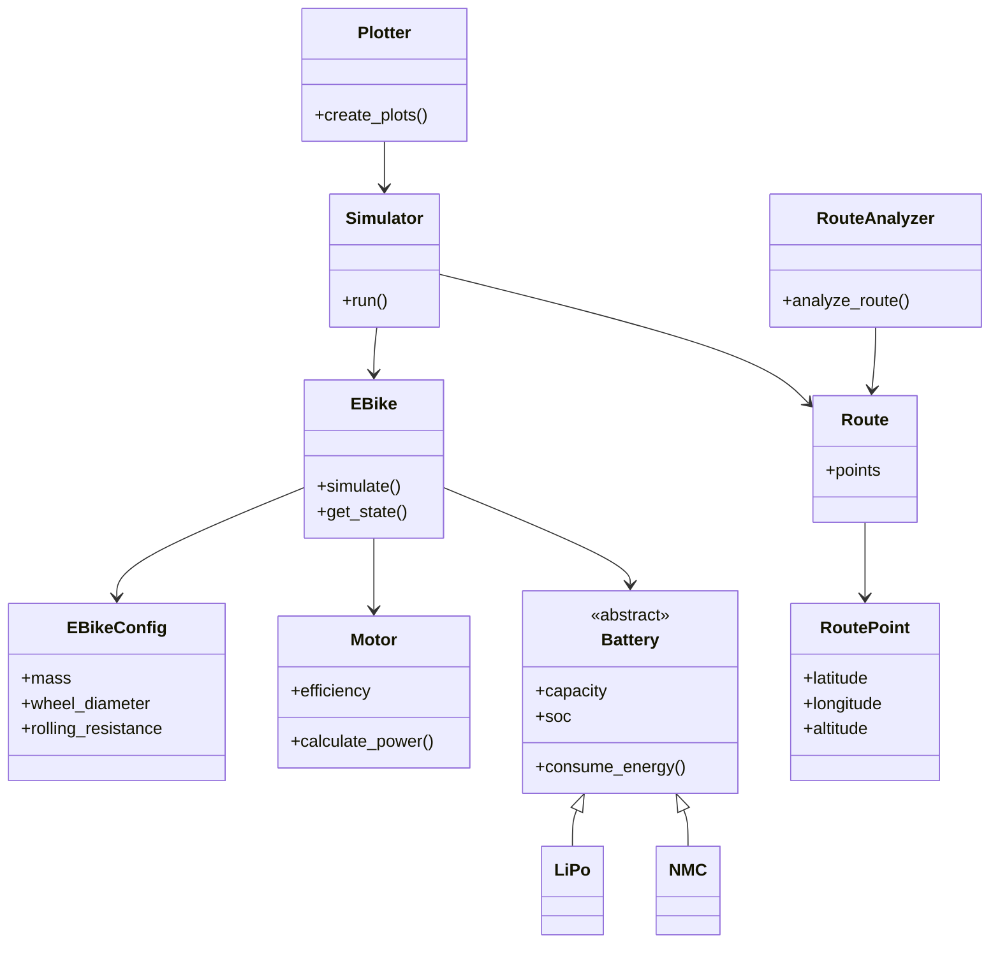
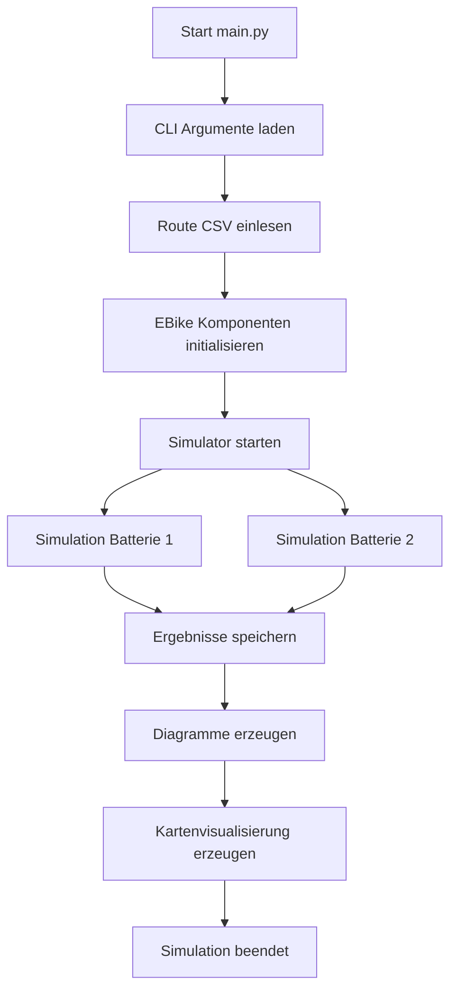

# EBikeSimulator

Ein Python-basierter Simulator zur Modellierung und Analyse eines Elektrofahrrads unter verschiedenen Fahrbedingungen.

Das Projekt simuliert das Verhalten eines E-Bikes auf einer vorgegebenen Strecke und berücksichtigt dabei unter anderem Route, Geschwindigkeit, Gewicht, Motorcharakteristik und unterschiedliche Akkumodelle.

## Features

* Simulation eines E-Bikes auf einer geladenen Strecke
* Unterstützung verschiedener Batterievarianten
* Berechnung des Energieverbrauchs während der Fahrt
* Kommandozeilen-Interface (CLI)
* Grafische Benutzeroberfläche (GUI)
* Auswertung und Visualisierung der Simulationsergebnisse
* Kartendarstellung der Route
* Modulare Architektur mit Tests

## Installation

### Voraussetzungen

Benötigt werden:

* Python >= 3.x
* pip

Es wird empfohlen, eine virtuelle Python-Umgebung zu verwenden.

### Repository klonen

```bash
git clone https://github.com/lsteiner13/EBikeSimulator.git
cd EBikeSimulator
```

### Virtuelle Umgebung erstellen

```bash
python -m venv .venv
```

Aktivieren:

**Windows**

```bash
venv\Scripts\activate
```

**Linux/macOS**

```bash
source venv/bin/activate
```

### Abhängigkeiten installieren

```bash
pip install -r requirements.txt
```

---

# Verwendung

## Kommandozeilen-Version (CLI)

Die Simulation kann direkt über `main.py` gestartet werden:

```bash
python main.py
```

## CLI-Argumente

| Argument       | Typ    | Standardwert                        | Beschreibung                           |
| -------------- | ------ | ----------------------------------- | -------------------------------------- |
| `--route_file` | String | `data/final_project_input_data.csv` | Pfad zur CSV-Datei mit den Routendaten |
| `--soc`        | Float  | `1.0`                               | Start-Ladezustand des Akkus (0 bis 1)  |
| `--weight`     | Float  | `85`                                | Gesamtgewicht des Systems in kg        |

## Beispiele

Simulation mit Standardwerten:

```bash
python main.py
```

Eigene Route simulieren:

```bash
python main.py --route_file data/meine_route.csv
```

Simulation mit 50 % Akkuladung:

```bash
python main.py --soc 0.5
```

Simulation mit anderem Gewicht:

```bash
python main.py --weight 100
```

Mehrere Parameter kombinieren:

```bash
python main.py \
    --route_file data/alpen_route.csv \
    --soc 0.8 \
    --weight 95
```

---

# Grafische Benutzeroberfläche (GUI)

Die grafische Oberfläche kann über `main_gui.py` gestartet werden:

```bash
python main_gui.py
```

Die GUI ermöglicht eine komfortablere Bedienung der Simulation ohne direkte Eingabe von Kommandozeilenparametern.

---

# Projektstruktur

```
EBikeSimulator/
│
├── data/                   # Eingabedaten und Routen
│
├── gui/                    # Grafische Benutzeroberfläche
│
├── src/                    # Kernlogik der Simulation
│   ├── bike/
│   ├── battery/
│   ├── motor/
│   └── simulation/
│
├── tests/                  # Unit- und Integrationstests
│
├── tools/                  # Hilfsprogramme
│
├── main.py                 # CLI Einstiegspunkt
├── main_gui.py             # GUI Einstiegspunkt
├── requirements.txt        # Python Abhängigkeiten
├── LICENSE                 # MIT Lizenz
└── README.md
```

---

# Architektur

Der Simulator ist modular aufgebaut.

Die wichtigsten Komponenten:

## EBike

Repräsentiert das komplette Fahrradmodell und verbindet:

* Motor
* Batterie
* Konfiguration
* Simulationsparameter

## Motor

Verantwortlich für:

* Leistungsberechnung
* Wirkungsgrad
* Energiebedarf

## Batterie

Abstrakte Basisklasse für verschiedene Akkumodelle.

Unterstützte Varianten:

* LiPo
* NMC

## Route

Verwaltet die Streckendaten:

* Position
* Höhe
* Geschwindigkeit
* Umgebungsdaten

## Simulator

Steuert den eigentlichen Simulationsablauf und führt die Berechnungen über die Route aus.

---

# Klassendiagramm



---

# Simulationsablauf



---

# Tests

Das Projekt enthält Unit- und Integrationstests, um die physikalischen Berechnungen (Motor, Batterie) und den Ablauf der Simulation abzusichern.

Die Tests können im Terminal aus dem Hauptverzeichnis gestartet werden:
```bash
python -m unittest discover tests/

# Ergebnisse

Während der Simulation werden verschiedene Kennwerte berechnet und visualisiert, beispielsweise:

* Energieverbrauch
* Akkustand über die Strecke
* Leistungsbedarf
* Streckenprofil

---

# Autor

**EBikeSimulator**

Entwickelt als Programmierprojekt im Rahmen von
**Programmieren I**

Lukas Steiner & Ilian Martic
